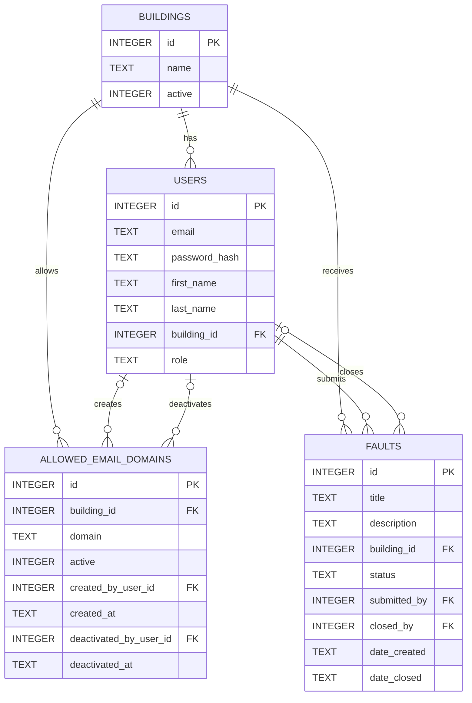

# Secure Fault Reporting and Resolution System

A Flask and SQLite demonstration application for reporting and resolving building maintenance faults. The account journey follows applicable GOV.UK Design System patterns within the scope of this demonstration application. This is not a claim of full GOV.UK compliance or production readiness.

## Features

- Email addresses are the case-insensitive account and sign-in identifier.
- Every account belongs to one named regional centre.
- Public account creation is available only when the exact email domain is active for the selected building.
- Estates administrators can see users and manage accepted domains only for their own building.
- Faults are reported against a selected named regional centre.
- Fault lists display submitters' full names, never their email addresses.
- Flask-Login, global CSRF protection, Werkzeug password hashing and throttled login POSTs protect account journeys.
- GOV.UK Frontend 6.3.0 provides form, error-summary, notification, table, select and password-input components with non-GOV.UK service branding.

## Local setup

Use Python 3.11 or later and a current Node.js release.

```powershell
python -m venv .venv
.venv\Scripts\Activate.ps1
python -m pip install -r requirements.txt
npm install
npm run build
$env:SECRET_KEY = "replace-with-a-long-random-value"
python run.py
```

On macOS or Linux, activate with `source .venv/bin/activate` and export `SECRET_KEY`. Open `http://127.0.0.1:5000` after startup. `SECRET_KEY` is required outside tests. Set `SESSION_COOKIE_SECURE=true` for HTTPS deployments; it remains off for local HTTP development. Cookies are HTTP-only and use SameSite=Lax.

## Accounts, buildings and email eligibility

The public **Create an account** journey asks for email address, first name, last name, regional centre, and password. Email addresses are trimmed, validated without DNS queries, normalised to lowercase and stored with case-insensitive uniqueness. Registration does not sign the user in.

The selected active regional centre must contain an active allowed-domain record matching the part after the final `@` exactly. Wildcards, substring matching and subdomain inheritance are not supported: `digital.hmrc.gov.uk` does not match `hmrc.gov.uk`. There is no public bypass.

The database seeds exactly these 14 regional centres idempotently: Belfast, Birmingham, Bristol, Cardiff, Croydon, Edinburgh, Glasgow, Leeds, Liverpool, Manchester, Newcastle, Nottingham, Portsmouth and Stratford. `hmrc.gov.uk` is seeded for all 14.

## Estates administration

After signing in, an administrator can open **Users** to see accounts in their building and create users or administrators assigned to that same building. **Email domains** lists active and inactive entries for their building. Administrators can add, deactivate and reactivate entries. Entries are retained rather than deleted and can be reactivated. Deactivation metadata represents the current inactive state and is cleared when an entry is reactivated. Deactivation affects new registrations only. Python permission checks and building-scoped SQL enforce this scope, including crafted requests.

### Create an administrator securely

Deployment operators can create an administrator for any active regional centre. The password is hidden and cannot be supplied as a command-line option:

```powershell
$env:FLASK_APP = "run.py"
flask create-admin
```

The command prompts for email, first name, last name, building and password. For architectures that require environment bootstrap before the first request, set all five values; an invalid or unknown building fails rather than being substituted:

```text
INITIAL_ADMIN_EMAIL
INITIAL_ADMIN_PASSWORD
INITIAL_ADMIN_FIRST_NAME
INITIAL_ADMIN_LAST_NAME
INITIAL_ADMIN_BUILDING
```

`INITIAL_ADMIN_USERNAME` is not supported.

### Tutor demonstration

1. Sign in as the selected building's Estates administrator.
2. Open **Email domains** and add the domain after the `@` in the tutor's email address.
3. The tutor opens **Create an account** and selects that same building.
4. The tutor registers with their own email address.
5. Open **Users** as the administrator to demonstrate building-scoped visibility.

## Assessment database

Generate a sanitised SQLite database containing only deterministic fictional assessment data:

```powershell
python scripts/create_assessment_db.py
```

The default output is:

```text
assessment_artifacts/secure_fault_reporting_assessment.db
```

The database contains these demonstration accounts:

| Name | Regional centre | Role | Email address |
|---|---|---|---|
| Alex Morgan | Glasgow | Administrator | `alex.morgan@glasgow.example.com` |
| Priya Shah | Glasgow | User | `priya.shah@glasgow.example.com` |
| Jamie Brown | Glasgow | User | `jamie.brown@glasgow.example.com` |
| Taylor Reid | Edinburgh | Administrator | `taylor.reid@edinburgh.example.com` |
| Morgan Lee | Edinburgh | User | `morgan.lee@edinburgh.example.com` |
| Sam Patel | Edinburgh | User | `sam.patel@edinburgh.example.com` |

All six accounts use the assessment-only password:

```text
AssessmentDemo!2026
```

Choose another output location with `--output`. Generation refuses to overwrite an existing file unless `--force` is supplied:

```powershell
python scripts/create_assessment_db.py --output "C:\assessment\assessment.db"
python scripts/create_assessment_db.py --force
```

The generated database contains no production data and must never replace `instance/app.db`. Database files are intentionally excluded from Git by the `*.db` ignore rule, so add the generated database separately to the assessment submission ZIP.

To run the application against the assessment database, ensure the `INITIAL_ADMIN_*` environment variables are unset, set a temporary local secret, and pass the existing `DATABASE` configuration override:

```powershell
$env:SECRET_KEY = "assessment-demo-local-only"
python -c "from pathlib import Path; from app import create_app; database = Path('assessment_artifacts/secure_fault_reporting_assessment.db').resolve(); app = create_app({'DATABASE': str(database)}); app.run()"
```

This override applies only to that process and leaves the normal `instance/app.db` path unchanged.

## Password policy

Passwords must contain at least 12 characters. Spaces and ordinary Unicode characters are accepted; there are no uppercase, lowercase, number, symbol or artificial maximum-length rules. A small explicit list of common passwords, including `password`, `qwerty`, `welcome`, `admin`, `government` and `hmrc`, is rejected after case-folding and removing non-alphanumeric characters. The application also rejects simple repetition and a small set of obvious sequences; it does not attempt to detect every possible variation of a listed password. Passwords are never redisplayed or logged and are stored only as Werkzeug hashes.

## Login throttling

Only POST login attempts are limited. `LOGIN_RATE_LIMIT` defaults to `5 per minute`; GET requests remain available. Flask-Limiter uses `RATELIMIT_STORAGE_URI`, which defaults to `memory://` for local use and deterministic isolated tests. In-memory storage is not suitable for multi-process production deployment. Configure shared storage such as Redis in production.

## Database initialisation

The application initialises `instance/app.db` automatically and idempotently on the first application request. The `flask create-admin` command also initialises the database before creating the administrator. SQLite foreign keys are enabled on every application connection and checked after initialisation.

The application does not migrate older database schemas. When the schema changes during development, recreate the local database and then recreate the administrator securely. Back up any data that must be retained before replacing a database.

### Current entity relationship diagram



Production schema changes require a separately designed and tested migration process; deleting and recreating a production database is not appropriate.

## Development and verification

```powershell
python -m pytest
npm run build
git diff --check
```

Frontend source is in `app/static/src/application.scss`. `npm run build` compiles CSS and copies GOV.UK Frontend JavaScript from `node_modules`.

## Privacy and security decisions

Email addresses are personal data. They are not placed in URLs or shown in general fault listings. Only an administrator for the same building can browse an account email. Password hashes are never rendered. SQL values are parameterised, CSRF remains globally enabled, unsafe post-login redirect targets are rejected, and login errors do not disclose whether an account exists.

## Security limitations

Before production use, consider organisational single sign-on, multi-factor authentication, email ownership confirmation, account recovery, account deactivation, central audit logging, shared rate-limit storage, penetration testing, formal accessibility testing, user research and a service assessment.
